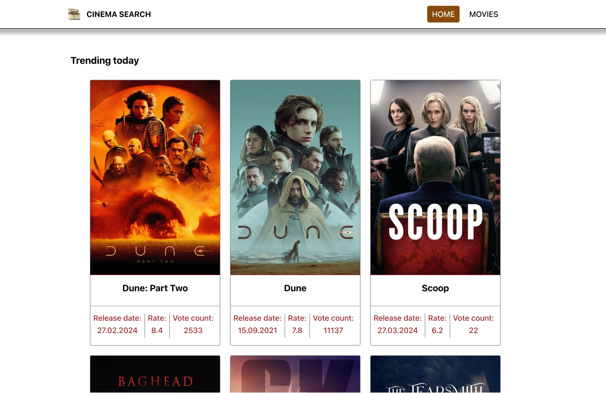
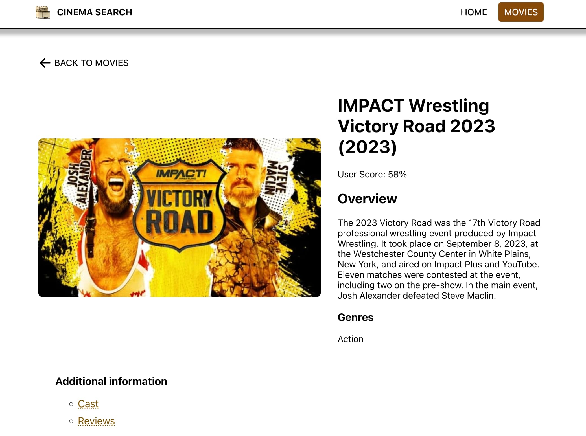
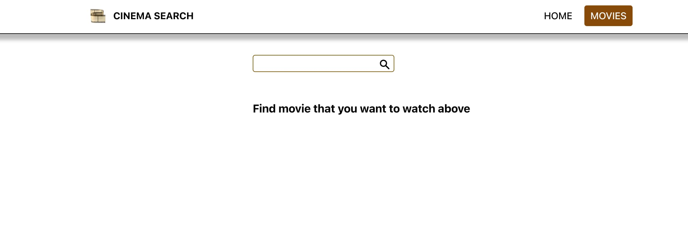

# React: SPA "Cinema search" with Routing

---

## Description

This project is a React Single Page Application (SPA) named "Cinema search" with routing. It was developed as a homework assignment to demonstrate knowledge of React.js concepts and implementation of routing within a single page application.

---

## Screenshots

#### Home Page

#### Movie Details

#### Search Page

---

## Features

- Search for movies by title or genre
- View movie details including synopsis, release date, and ratings
- Navigate between different pages using routing
- Responsive design for optimal viewing on various devices

---

## Technologies Used

- React.js
- React Router
- HTML5
- CSS3

---

## Installation

1. Clone the repository: `git clone https://github.com/NRie-22/goit-react-hw-05-movies?tab=readme-ov-file`
2. Install dependencies: `npm install`
3. Start the development server: `npm start`
4. Open `http://localhost:3000` in your browser to view the application

---

## How to Use

1. On the homepage, use the search bar to search for movies by title or genre.
2. Click on a movie card to view its details.
3. Navigate between different pages using the navigation menu or back/forward buttons.

---

## Contributions

Contributions, bug reports, and feature requests are welcome! Feel free to open an issue or create a pull request.

---

## Author

Nataliya Rieger
